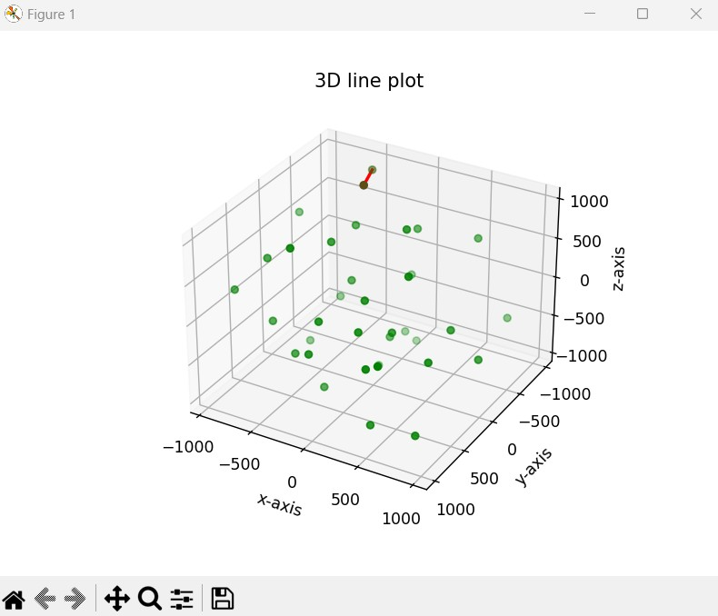

# Tugas Kecil 2 - Strategi Algoritma 
Tugas Kecil 2 IF2211 – Strategi Algoritma Tahun 2022/2023

## Table of Contents
* [General Info](#general-information)
* [Technologies Used](#technologies-used)
* [Penjelasan Singkat Algoritma](#Penjelasan-Singkat-Algoritma)
* [Features](#features)
* [Screenshots](#screenshots)
* [Setup](#cara-menjalankan-program)
* [Project Status](#project-status)
* [Room for Improvement](#room-for-improvement)
* [Pembagian](#pembagian-tugas)

## General Information
### Mencari Pasangan Titik Terdekat 3D dengan Algoritma Divide and Conquer

Persoalan tersebut dirumuskan untuk titik pada bidang datar (2D). Pada Tucil 2 kali ini kita mengembangkan algoritma mencari sepasang titik terdekat pada bidang 3D. Misalkan terdapat n buah titik pada ruang 3D. Setiap titik P di dalam ruang dinyatakan dengan koordinat P = (x, y, z). Kita mencari sepasang titik yang mempunyai jarak terdekat satu sama lain. Jarak dua buah titk P1 = (x1, y1, z1) dan P2 = (x2, y2, z2) dihitung dengan rumus Euclidean 

## Technologies Used
- python (3.11)
- numpy 
- matplotlib

## Penjelasan Singkat Algoritma
1.	Urutkan array of points berdasarkan besar koordinat x.
2.	Jika jumlah titik < =3, selesaikan dengan bruteforce.
3.	Jika jumlah titik > 3, cari L yang merupakan median dari semua koordinat x, kemudian bagi ruang menjadi 2 ruang dengan jumlah point yang sama menggunakan median L.
4.	Lakukan rekursi pada setiap ruang dan simpan nilainya dalam d1 dan d2.
5.	Ambil nilai terkecil dari d1 dan d2, simpan di d3.
6.	Kumpulkan semua titik yang berada di antara L + d3 dan L-d3 pada sumbu x, simpan dalam array SL.
7.	Urutkan semua titik pada SL berdasarkan sumbu Y.
8.	Lakukan traversal pada semua titik pada SL. Untuk setiap titik, lakukan perbandingan pada titik-titik selanjutnya pada sumbu Y menggunakan jarak euclidean. Jika jarak euclideannya lebih kecil dari nilai d3, ubah nilai d3 dengan nilai jarak euclidean tersebut. Ulangi hingga selisih titik dengan titik yang dibandingkanny pada sumbu Y melebihi nilai d3. Jika melebihi d3, lanjutkan traversal pada titik selanjutnya.
9.	Kembalikan nilai d3.

## Features
- Implementasi dari algoritma divide and conquer pada kode program closest pair of points
- visualisasi program dengan matplotlib
- optimalisasi program 

## Screenshots

## Cara menjalankan program 
1. Buka terminal pada folder src
2. Jalankan program dengan perintah 'py -3.11 -m visual' 
3. Masukan jumlah dimensi yang diinginkan
4. Masukkan jumlah titik yang diinginkan 

## Project Status
Project is: _complete_ 

## Room for Improvement

Room for improvement:
- speed up for algorithm
- algorithm optimization

## Pembagian Tugas
1. Nigel Sahl (13521043)        : Membuat algoritma Divide and Conquer, visualisasi program, dan menulis laporan
2. Athif Nirwasito (13521053)   : Membuat algoritma Divide and Conquer, optimalisasi program, dan menulis laporan